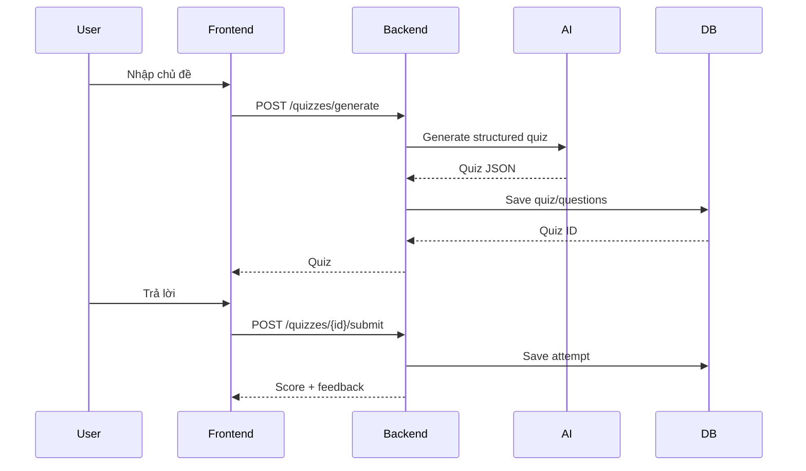
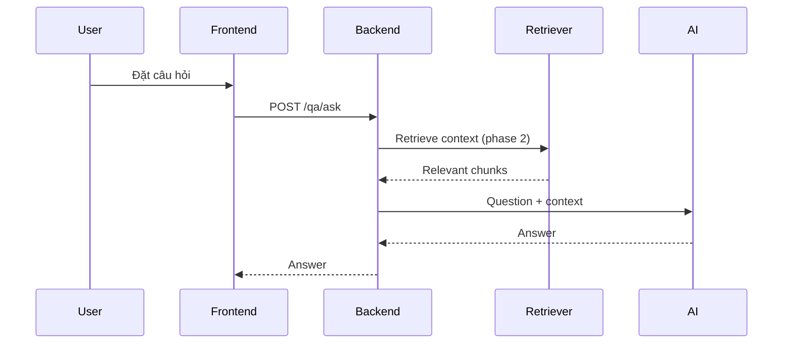

# Architecture

## 1. Mục tiêu

EDU AI Quiz & Q&A được thiết kế theo kiến trúc tách frontend/backend để thuận tiện phát triển nhóm, kiểm thử và triển khai độc lập.

## 2. Thành phần

### Frontend

- Next.js App Router.
- TypeScript.
- Gọi REST API qua `NEXT_PUBLIC_API_URL`.
- Các màn hình: Home, Dashboard, Quiz, AI Q&A, Login.

### Backend

- FastAPI.
- SQLAlchemy async.
- JWT auth.
- Service layer tách logic AI và nghiệp vụ.

### Database

PostgreSQL lưu:

- users
- quizzes
- questions
- attempts
- conversations
- messages
- documents

`pgvector` dành cho embedding tài liệu khi triển khai RAG.

### AI

Hai use case chính:

1. Quiz Generation: chủ đề -> prompt -> JSON quiz -> validate -> lưu DB.
2. Q&A: câu hỏi + lịch sử/ngữ cảnh -> AI -> trả lời -> lưu conversation.

## 3. Luồng Quiz

## 4. Luồng Q&A

## 5. Nguyên tắc mở rộng

- Route chỉ xử lý HTTP.
- Service xử lý logic nghiệp vụ.
- Model chỉ mô tả dữ liệu DB.
- Schema kiểm soát request/response.
- AI output phải validate trước khi lưu DB.
- Không lưu API key trong source code.
