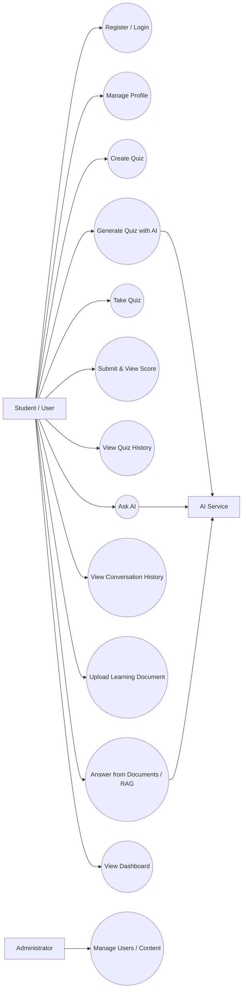
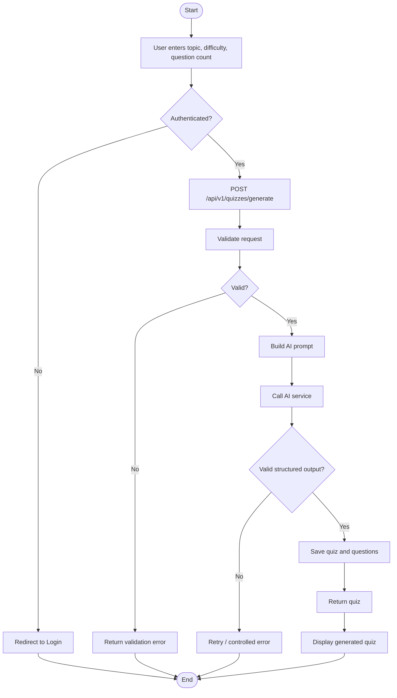
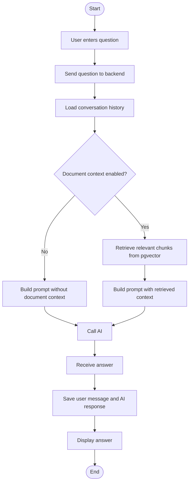
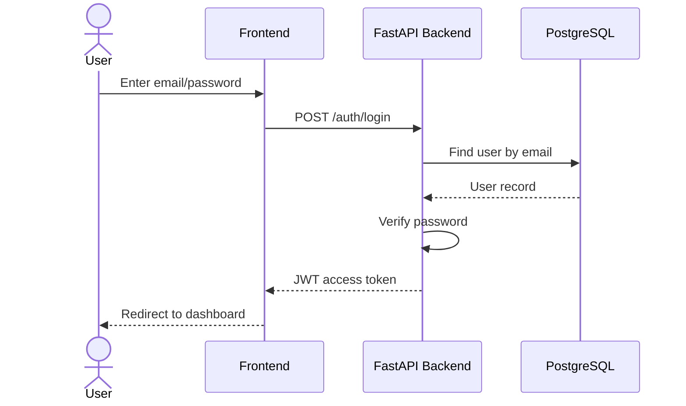
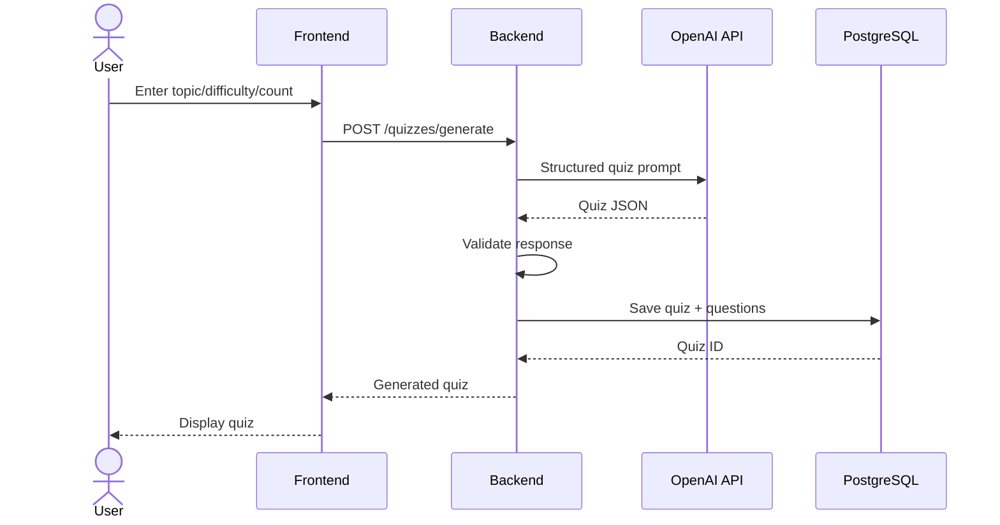
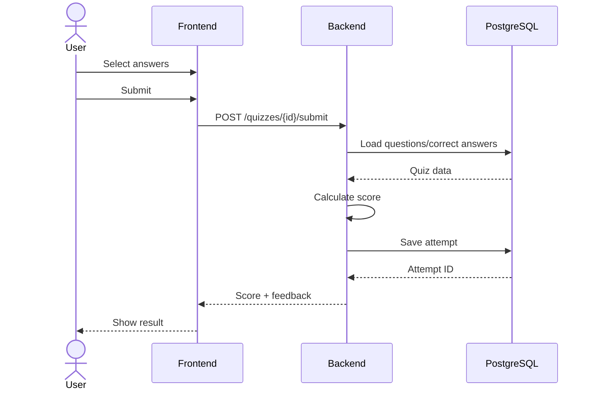
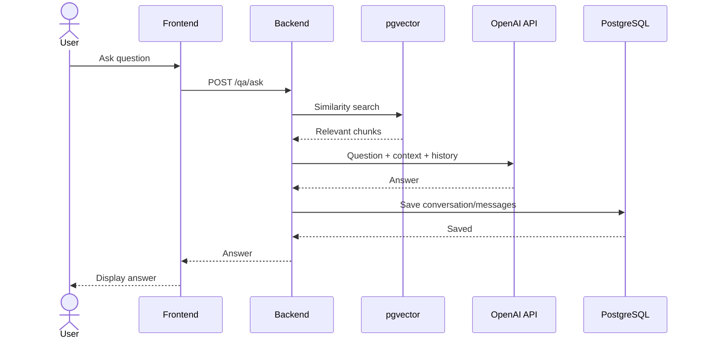

# System Analysis — EDU AI Quiz & Q&A

## 1. Use Case Diagram

## 2. Use Case Description

### UC-01 — Register / Login

**Actor:** User  
**Precondition:** User chưa đăng nhập.  
**Main flow:**
1. User nhập thông tin đăng ký hoặc tài khoản đăng nhập.
2. Frontend gửi request tới backend.
3. Backend kiểm tra dữ liệu và mật khẩu.
4. Backend trả JWT nếu hợp lệ.
5. Frontend lưu trạng thái đăng nhập và chuyển tới dashboard.

**Postcondition:** User có phiên đăng nhập hợp lệ.

### UC-02 — Generate Quiz with AI

**Actor:** User, AI Service  
**Precondition:** User đã đăng nhập.  
**Main flow:**
1. User nhập chủ đề, độ khó, số câu hỏi.
2. Backend xây dựng prompt.
3. AI Service sinh dữ liệu quiz dạng structured output.
4. Backend validate kết quả.
5. Quiz và câu hỏi được lưu vào database.
6. Quiz được trả về frontend.

**Alternative flow:** AI trả dữ liệu sai định dạng → backend retry hoặc trả lỗi có kiểm soát.

### UC-03 — Take Quiz & Submit

**Actor:** User  
**Precondition:** Quiz tồn tại.  
**Main flow:**
1. User mở quiz.
2. Hệ thống hiển thị câu hỏi và đáp án.
3. User chọn đáp án.
4. User submit bài.
5. Backend chấm điểm.
6. Backend lưu attempt.
7. Frontend hiển thị điểm và feedback.

### UC-04 — Ask AI

**Actor:** User, AI Service  
**Precondition:** User đã đăng nhập.  
**Main flow:**
1. User nhập câu hỏi.
2. Backend lấy lịch sử hội thoại và/hoặc context tài liệu.
3. Backend gửi prompt đến AI Service.
4. AI trả câu trả lời.
5. Hệ thống lưu message và response.
6. Frontend hiển thị câu trả lời.

## 3. Activity Diagram — AI Quiz Generation

## 4. Activity Diagram — Q&A

## 5. Sequence Diagram — Authentication

## 6. Sequence Diagram — AI Quiz

## 7. Sequence Diagram — Quiz Submission

## 8. Sequence Diagram — AI Q&A with RAG

## 9. Main Functional Requirements

| ID | Requirement | Priority |
|---|---|---|
| FR-01 | User can register and login | Must |
| FR-02 | User can create and view quizzes | Must |
| FR-03 | AI can generate quizzes | Must |
| FR-04 | User can take and submit quizzes | Must |
| FR-05 | System saves score/history | Must |
| FR-06 | User can ask AI questions | Must |
| FR-07 | System stores conversations | Should |
| FR-08 | User can upload documents | Should |
| FR-09 | Q&A can retrieve document context | Should |
| FR-10 | Dashboard shows learning progress | Should |

## 10. Non-functional Requirements

- **Security:** password hashing, JWT authentication, secrets stored in environment variables.
- **Performance:** common API response target under 2 seconds excluding AI latency.
- **Maintainability:** frontend/backend separation, service layer, schemas and models separated.
- **Scalability:** PostgreSQL, Redis and stateless API architecture.
- **Reliability:** input validation, controlled AI errors, tests and CI.
- **Usability:** responsive web interface and simple learning flow.
